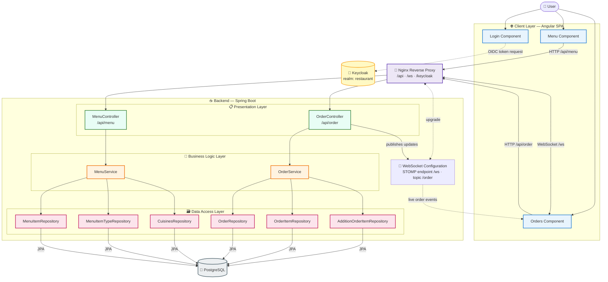

# Food ordering system

## AI-Assisted Development

> [!NOTE]
> This codebase was developed with the assistance of **AI coding agents** (e.g., Cline). Most of the code, tests, documentation, and infrastructure configuration in this repository were generated by AI agents under human review and supervision.

## Build and Run

The project is designed to be built and run entirely with Docker. The Maven build steps are retained for reference but are no longer required for normal development or deployment.

### Using Docker (recommended)

The project includes a two-stage Docker build:

1. Build the intermediate Maven dependencies image (only needed when `pom.xml` changes):
   ```sh
   docker build -t restaurant-maven-deps:latest -f dockerfile.maven .
   ```

2. Build the application image:
   ```sh
   docker build -t restaurant-backend:latest -f Dockerfile .
   ```

### Run

#### Using Docker
```sh
docker run --rm -p 8081:8080 restaurant-backend:latest
```

### Docker Compose
To run the full application stack (database, backend, auth-service, and frontend) using Docker Compose:
```sh
docker-compose up --build
```

This will start:
- **Frontend**: http://localhost:8082
- **Backend**: http://localhost:8081
- **Restaurant database**: PostgreSQL on port 5433
- **Auth service**: `marczakx/auth:2` with its own PostgreSQL database and Liquibase migrations
- **Auth database**: PostgreSQL used only by the auth service

Authentication is delegated to the **auth-service**. The frontend Nginx proxies `/login` to the auth service and protects `/api/*` with `auth_request` verification. Login credentials: `demo` / `demo`.

To stop all services:
```sh
docker-compose down
```

### Image Versioning

All images pushed to Docker Hub are versioned. The version is stored in the
`VERSION` file and every image is tagged twice: `<version>` and `latest`.
Kubernetes manifests reference the pinned version tag.

Images built from this repository:
- `marczakx/restaurant-backend` (root `Dockerfile`)
- `marczakx/restaurant-frontend` (`front/Dockerfile`)
- `marczakx/restaurant-e2e` (`front/Dockerfile.e2e`, Cypress runner)

Build and push (all images or a single target):
```sh
./scripts/build-and-push.sh              # backend + frontend + e2e
./scripts/build-and-push.sh e2e          # only the E2E runner
```

To release a new version, bump `VERSION` and update the pinned tags in
`kubernetes/*-deployment.yaml` / `kubernetes/e2e-tests-job.yaml`.

### Running E2E Tests on Kubernetes

The Cypress E2E tests can be executed against the application deployed in the
`restaurant` namespace. The `baseUrl` is configurable via the `CYPRESS_BASE_URL`
environment variable (default: `http://localhost:8082`).

#### Option A – In-cluster Job (recommended)

Tests run as a Kubernetes Job inside the cluster and target the frontend service
directly (`http://frontend:80`), so no ingress or LoadBalancer access is needed:

```sh
./scripts/run-e2e-k8s.sh
```

The script builds the runner image from `front/Dockerfile.e2e` (tagged with the
version from `VERSION`), loads it into a local minikube/kind cluster when
detected, applies `kubernetes/e2e-tests-job.yaml` and streams the results.

Useful overrides:
```sh
K8S_NAMESPACE=restaurant \
E2E_IMAGE=marczakx/restaurant-e2e:latest \
CYPRESS_BASE_URL=http://frontend:80 \
./scripts/run-e2e-k8s.sh
```

Manual steps, if preferred:
```sh
./scripts/build-and-push.sh e2e
kubectl delete job e2e-tests -n restaurant --ignore-not-found=true
kubectl apply -f kubernetes/e2e-tests-job.yaml -n restaurant
kubectl wait --for=condition=complete --timeout=15m job/e2e-tests -n restaurant
kubectl logs job/e2e-tests -n restaurant
```

#### Option B – From the workstation

Forward the frontend service to localhost and run Cypress locally:
```sh
kubectl port-forward svc/frontend 8082:80 -n restaurant
cd front && npm run cypress:run
```

Or point Cypress at the LoadBalancer/ingress address:
```sh
cd front && CYPRESS_BASE_URL=http://<external-ip> npm run cypress:run
```

### Recent Changes
- Fixed integration-tests container to use Maven JDK image
- Added Docker socket mounting for Testcontainers
- Fixed Cypress E2E tests to handle auth guard
- Fixed data.sql sequence initialization

### Code Review Notes and Suggestions

#### Security
- **Passwords stored in plain text**: User passwords are stored as plain text (e.g., `admin123`). Should use BCrypt/Argon2 hashing with Spring Security `BCryptPasswordEncoder`.
- **CORS configuration**: `@CrossOrigin` without restrictions allows access from any origin. Should configure allowed origins explicitly.
- **Authentication token**: Current token-based auth generates random UUID but doesn't validate it. Should implement proper JWT or session-based authentication.

#### Code Quality
- **OrderService.saveOrder**: Saves additionOrderItems and orderItems separately before saving order. Should use CascadeType.ALL on relationships.
- **OrderService.getOrderById**: Throws RuntimeException instead of custom exception. Should add global @ControllerAdvice for error handling.
- **MenuService.getMenuItemsByTypeName**: Uses orElseThrow() without clear error message. Should add descriptive message.
- **OrderService.addItemToOrder**: Creates MenuItem without price. Should verify item exists in database.
- **Order entity**: Uses CascadeType.MERGE. Should consider CascadeType.ALL or PERSIST for consistency.
- **OrderItem and AdditionOrderItem**: Missing @ManyToOne relationship with Order. Less readable.

## Application Architecture

The system is a layered web application. An **Angular SPA** talks to a
**Spring Boot** backend through an **Nginx** reverse proxy. Authentication is
delegated to **Keycloak**, data is stored in **PostgreSQL**, and order updates
are pushed to clients in real time over **WebSocket (STOMP)**.

### Layers at a Glance

| Layer          | Technology         | Key components                                                                                     |
|----------------|--------------------|----------------------------------------------------------------------------------------------------|
| Client         | Angular SPA        | Login, Menu, Orders components                                                                     |
| Edge / proxy   | Nginx              | Routes `/api/*`, `/ws`, `/keycloak/*`                                                              |
| Authentication | Keycloak           | Realm `restaurant`, client `restaurant-client`                                                     |
| Presentation   | Spring MVC         | `MenuController` (`/api/menu`), `OrderController` (`/api/order`)                                   |
| Real-time      | STOMP over WebSocket | Endpoint `/ws`, topic `/order`                                                                   |
| Business logic | Spring services    | `MenuService`, `OrderService`                                                                      |
| Data access    | Spring Data JPA    | Cuisines, MenuItem, MenuItemType, Order, OrderItem, AdditionOrderItem repositories                 |
| Persistence    | PostgreSQL         | `restaurant` database                                                                              |

### Component Diagram



### Request Flow

1. **Authentication** – the browser obtains a token from **Keycloak**
   (proxied by Nginx under `/keycloak`). The Angular `AuthGuard` protects
   routes and the `AuthInterceptor` attaches the token to API calls.
2. **Menu browsing** – `GET /api/menu/**` requests are proxied by Nginx to
   `MenuController`, which delegates to `MenuService`.
3. **Ordering** – order requests reach `OrderController`, which delegates to
   `OrderService`.
4. **Live updates** – after every order mutation, `OrderController` publishes
   the updated order to the STOMP topic `/order`; all connected clients receive
   it instantly through the `/ws` endpoint.
5. **Persistence** – both services read and write through their Spring Data
   JPA repositories into PostgreSQL.
